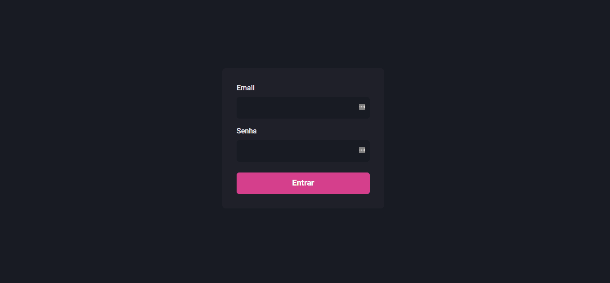

<div align="center">
	<h1>dashgo</h1>
</div>

## :camera: Demonstração

<p align="center">
	
</p> 

## :dart: Objetivo

Essa aplicação é um modelo de dashboards reutilizável feito em React e utilizando a biblioteca do Chackra UI.
Projeto ainda em desenvolvimento.

## :hammer_and_wrench: Ferramentas

- [React](https://pt-br.reactjs.org/)
- [Chakra UI](https://chakra-ui.com/)
- [NextJS](https://nextjs.org/)
- [TypeScript](https://www.typescriptlang.org/)
- [Node](https://nodejs.org/)
- [Yarn](https://yarnpkg.com/)

## :rocket: Executando o projeto

1.Clonando o repositório

```bash
git clone https://github.com/Felipefmv/dashgo
```

2.Para instalar rode

```
yarn
```

3.Rode

```
yarn start
```

4.Acesse http://localhost:3000/
